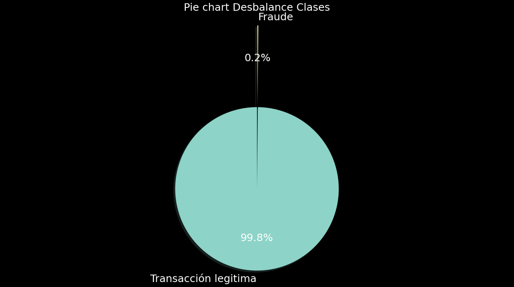
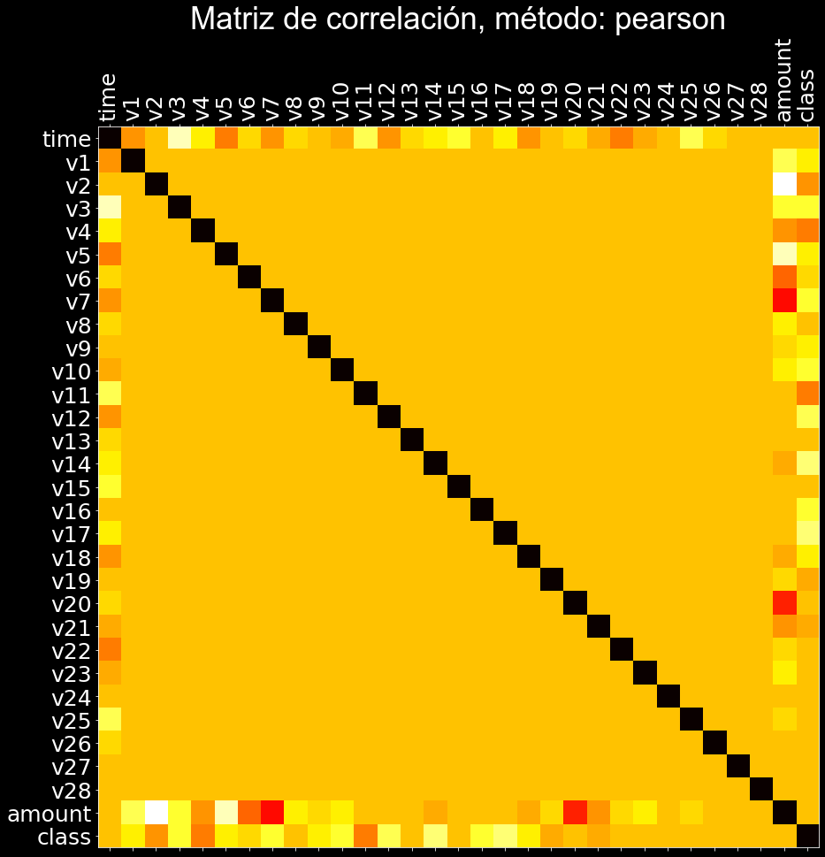
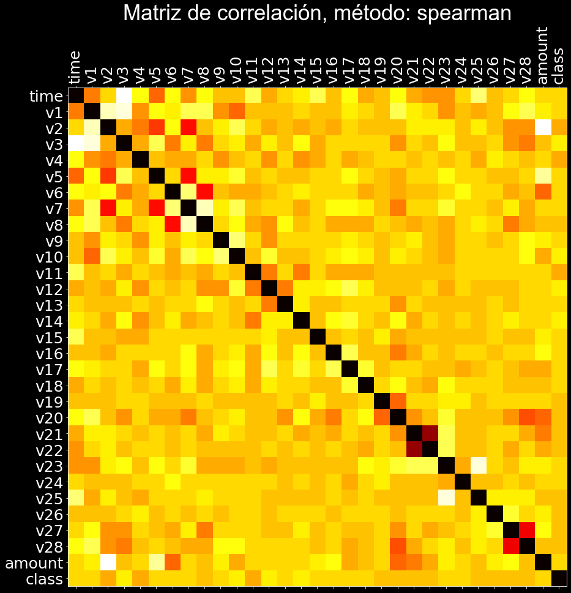
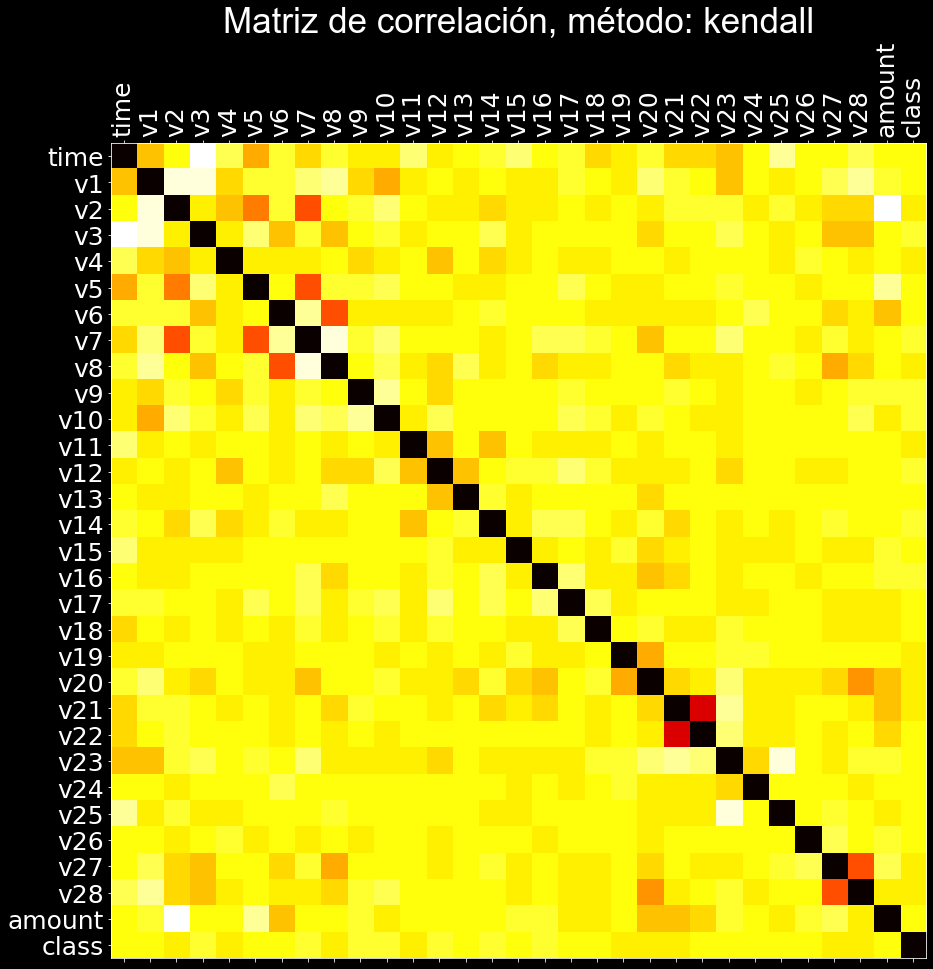

# fraud-detection

Repo donde se hace el análisis de detección de fraude para Rappi.

# EDA

## Desbalance del target del problema

  

## Correlación de variables

El coeficiente de correlación de Pearson (r) es una medida de correlación lineal entre dos variables. Su valor se encuentra entre -1 y +1, -1 indica una correlación lineal negativa total, 0 indica que no hay correlación lineal y 1 indica una correlación lineal positiva total. Además, r es invariante bajo cambios separados en la ubicación y escala de las dos variables, lo que implica que para una función lineal el ángulo con el eje x no afecta a r.

Para calcular r para dos variables X e Y, se divide la covarianza de X e Y por el producto de sus desviaciones estándar.
El coeficiente de correlación de rango de Spearman (ρ) es una medida de correlación monótona entre dos variables y, por lo tanto, es mejor para detectar correlaciones monotónicas 
no lineales que la r de Pearson. Su valor se encuentra entre -1 y +1, -1 indica una correlación monótona negativa total, 0 indica que no hay correlación monótona y 1 indica una correlación monótona positiva total. Para calcular ρ para dos variables X e Y, se divide la covarianza de las variables de rango de X e Y por el producto de sus desviaciones estándar.

De manera similar al coeficiente de correlación de rangos de Spearman, el coeficiente de correlación de rangos de Kendall (τ) mide la asociación ordinal entre dos variables. Su valor se encuentra entre -1 y +1, -1 indica una correlación negativa total, 0 indica que no hay correlación y 1 indica una correlación positiva total. Para calcular τ para dos variables X e Y, se determina el número de pares de observaciones concordantes y discordantes. τ viene dado por el número de pares concordantes menos los pares discordantes dividido por el número total de pares.

  

  

  

